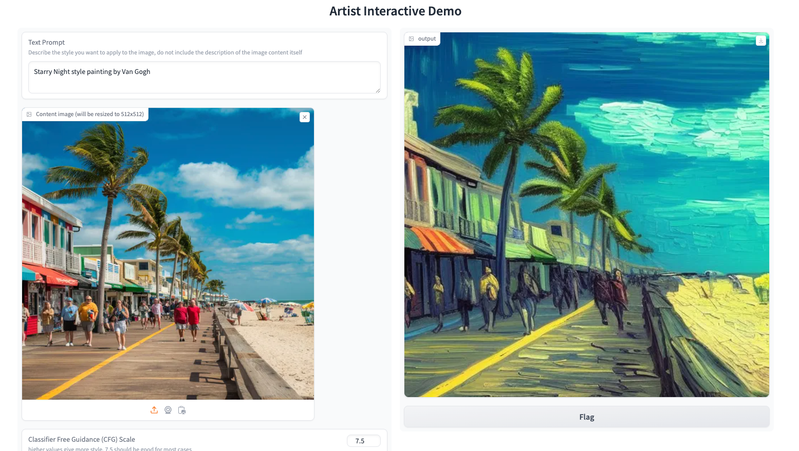

# Artist
## [Webpage](https://DiffusionArtist.github.io)| [arXiv](https://arxiv.org/abs/2407.15842)
Official repo for Artist: Aesthetically Controllable Text-Driven Stylization without Training


## What is Artist?
Artist is a training-free text-driven image stylization method. You give an image and input the prompt describing the desired style, Artist give you the stylized image in that style. The detail of the original image and the style you provide is harmonically integrated. 

**No** need to train, **no** need to download many ControNets or LoRAs. Just use a pretrained Stable Diffusion.

## Guide
Clone the repository:
```
git clone https://github.com/songrise/Artist
```

Create a virtual environment and install dependencies:
```
conda create -n artist python=3.8
conda activate artist
pip install -r requirements.txt
```

For the first time you execute the code, you need to wait for the download of the Stable Diffusion model from the Hugging Face repository.

Run the following command to start the gradio interface:
```
python injection_main.py --mode app
```
Visit `http://localhost:7860` in your browser to access the interface.



You can also run the following command to stylize an image in the command line:
```
python injection_main.py --mode cli --image_dir data/example/1.png --prompt "A B&W pencil sketch, detailed cross-hatching --config example_config.yaml"
```

## Citation
```
@misc{jiang2024artist,
      title={Artist: Aesthetically Controllable Text-Driven Stylization without Training},
      author={Ruixiang Jiang and Changwen Chen},
      year={2024},
      eprint={2407.15842},
      archivePrefix={arXiv},
      primaryClass={cs.CV}
      }
```